# SERVER ỨNG DỤNG QUẢN LÝ THỜI GIAN UỐNG THUỐC (CƠ BẢN)

Là server được viết bằng java với framework là spring boot. Hiện tại server để quản lý service là user.

## Getting Started
<h1 align="center"> MEDICINE SERVER </h1>
<p align = "center">Server Quản lý quy trình uống thuốc.</p>

## Mục lục
- [Cách cài đặt](#install)
- [Cách khởi chạy](#run)
- [Cấu trúc](#lib)
- [Chạy thử](#demo)

## Cách Cài Đặt <a name = "install"></a>

### 💡 Bắt Buộc Cài Đặt
- Cài Đặt SDK Java: 
Kiểm tra xem đã cài đặt hay chưa: (mở cmd)
```
java -version
```
Nếu trên máy chưa cài đặt thì làm theo hướng dẫn sau [Java SDK](https://www.youtube.com/watch?v=IJ-PJbvJBGs).
- Cài Đặt Intellij : IDE hỗ trợ code và debug [Tải về Intellij thử nghiệm](https://www.jetbrains.com/idea/download/download-thanks.html?platform=windows).

### Source Code
- Tải Về Source Code Từ Git Này Để Bắt Đầu Chạy Server.

## Cách Khởi Chạy <a name = "run"></a>
- Bước 1: Mở IDE Intellij và open souce code vừa tải về từ git.
- Bước 2: Chờ thanh góc phải màn hình load xong package.
- Bước 3: Bấm vào button có dạng start ở góc trên bên phải màn hình để bắt đầu.
- Bước 4: Test API với các engine hỗ trợ như chrome hoặc postman với đường dẫn là: [http://localhost:8080/users](http://localhost:8080/users)
- 💡 Chú ý: Nếu mọi người đang cùng xài chung mạng wifi thì dùng cmd tìm ip của máy:
```
ipconfig
```
Sau đó thay localhost thành ip của máy thì các máy khác sẽ có thể truy cập được ví dụ: [http://192.168.1.27:8080/users](http://localhost:8080/users)

## Cấu trúc <a name = "lib"></a>
Thống kê cấu trúc của source code server.
### Tổng quan cấu trúc:
Gồm có 5 phần chính: controller, entity, exception, model, service.
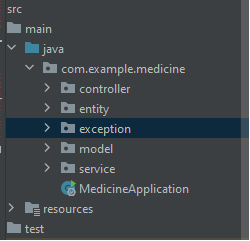
### Từng phần trong cấu trúc:
1. controller: 
Nơi tạo ra các API để client request, trong thư mục controller sẽ chứa nhiều controller xử lý cho 1 service khác nhau.
- RequestMapping kèm với string /users trên đầu class sẽ set cho cacs API trong class này bằng đầu với /users đồng nghĩa với đường dẫn [http://localhost:8080/users](http://localhost:8080/users)
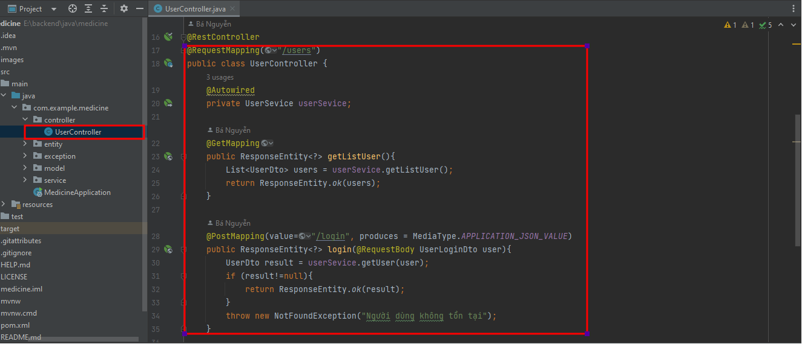
- Các function ở trong class controller đại diện cho các API với các phương thức được viết ở trên đầu mỗi class như @GetMapping là phương thức get.
- Nếu tồn tại value trong @PostMapping hoặc @GetMapping nghĩa là đường dẫn sẽ cộng thêm /... ví dụ: [http://localhost:8080/users/login](http://localhost:8080/users/login)
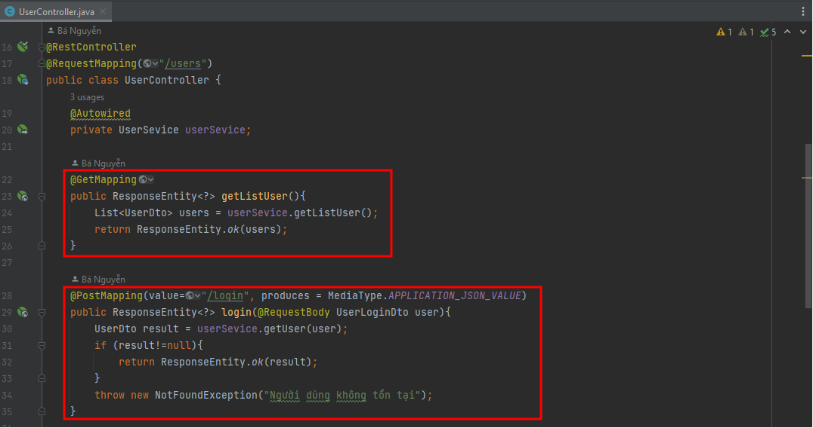
- Để tương tác được với dữ liệu controller sẽ tương tác với service với các hàm được định nghĩa trong service để có thể lấy hoặc thêm mới dữ liệu.
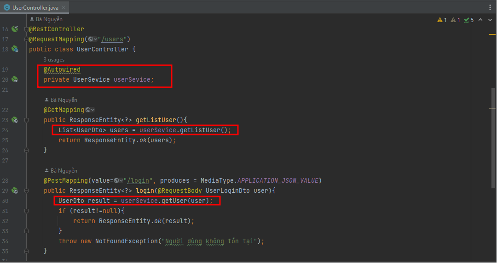
2. service: 
- Nơi định nghĩa và tương tác với dữ liệu, sẽ có 2 phần là UserService và UserServiceImpl. UserService sẽ viết ra các hàm theo dạng interface để controller gọi tới và tương tác được với dữ liệu.
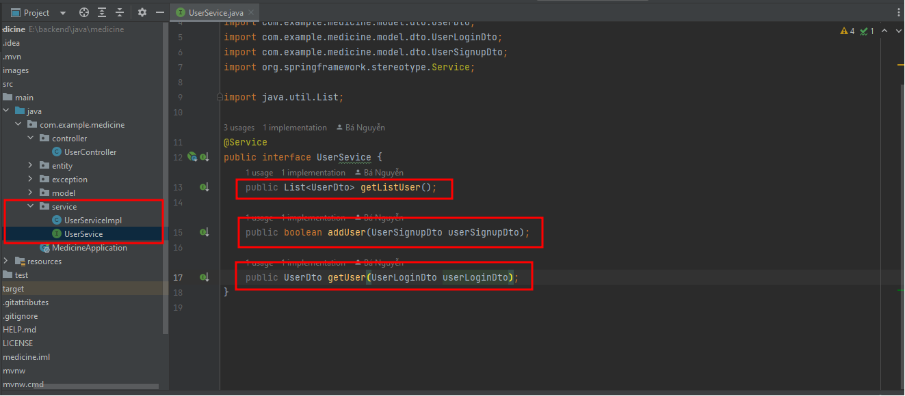
- Tại UserServiceImpl sẽ chịu trách nhiệm định nghĩa cho các hàm đã khai báo trong UserService. Ngoài ra có mảng dữ liệu user đăng nhập tạm nằm ở đây, nếu như có kết nối với database thì dữ liệu sẽ nằm trên database. 
- Các hàm được viết với override là đang ghi đè lại các hàm trong UserService để định nghĩa cho nó nhằm mục đích lưu trữ thêm dữ liệu vào mảng ở trên hoặc xuất dữ liệu ra.
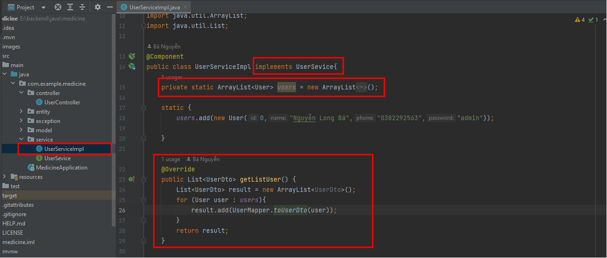
3. entity: 
- Nơi định nghĩa cho dữ liệu chính lưu trữ và xử lý ví dụ hiện tại là ta đang cần lưu trữ lại User sau khi đăng ký thành công.
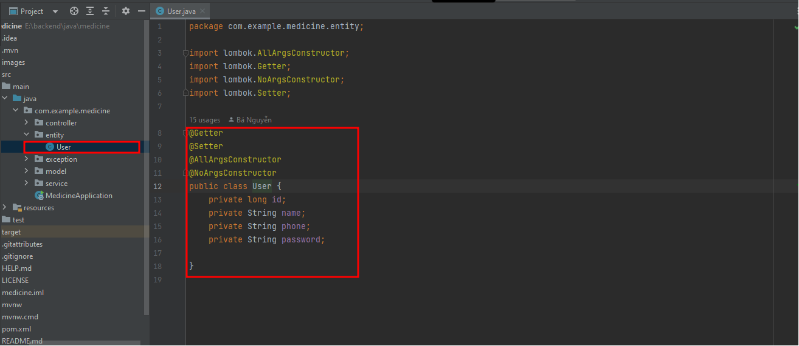
4. model: 
- Tại đây ta sẽ tạo ra các class data để sử dụng cho các API như login hoặc signup. 
- Dto nhằm mục đích định nghĩa cho dữ liệu truyền vào hoặc xuất ra của các API. Bởi vì, với API thông thường ta sẽ không xuất ra hết các biến trong class đó mà chỉ xuất vài thông tin nhất định, ví dụ như Đăng nhập thì chỉ cần phone và pass chứ ko cần name và id.
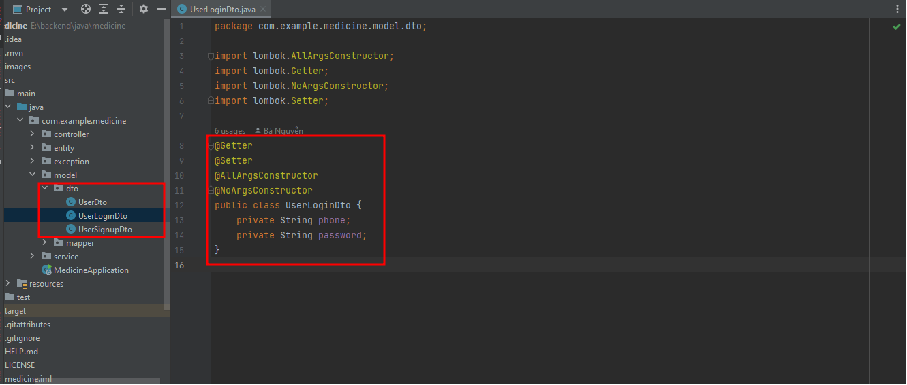
- Để có thể biến đổi từ kiểu dữ liệu gốc như User tại entity sang UserLoginDto ở dto trong model thì ta có class UserMapper chịu trách nhiệm convert các dữ liệu qua lại nhầm mục đích truyền vào hoặc xuất ra.
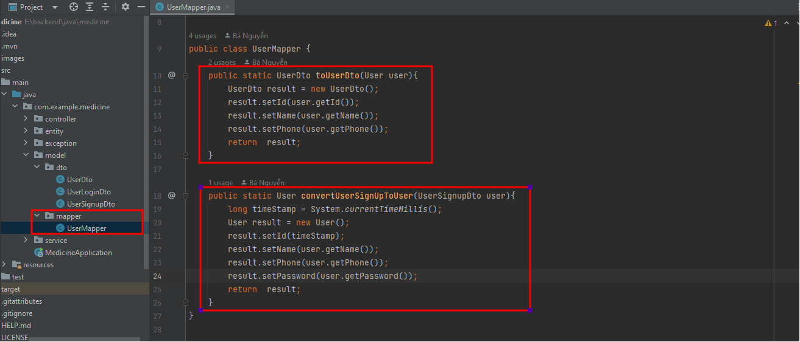
5. exception: 
- Tại đây sẽ liên quan đến định nghĩa các trường hợp lỗi trong API, giả sử như login nhưng không đúng phone hoặc pass hoặc đăng ký nhưng trùng số điện thoại lúc này ta sẽ định nghĩa xem thông tin sẽ trả về gì nếu như lỗi.
- Thông tin sẽ trả về 2 trường là : Kiểu lỗi http và thông báo lỗi với error code là 400.
 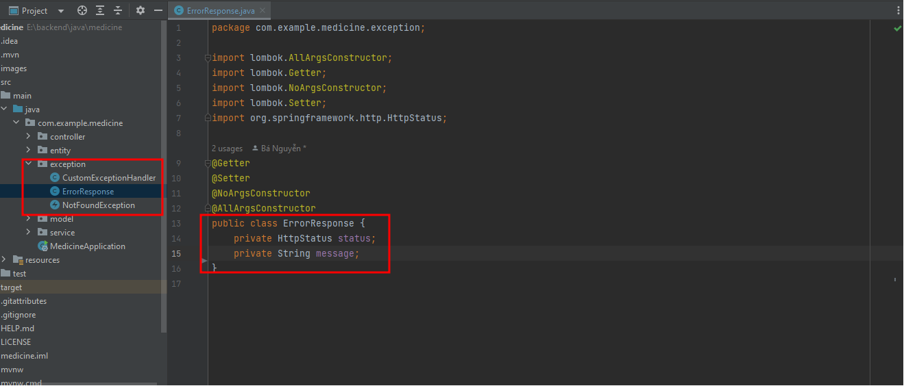
 - Class này sẽ định nghĩa các trường hợp xảy ra lỗi, tại đây để cho nhanh thì chỉ định nghĩa 1 kiểu duy nhất cho tất cả lỗi là not found với message được truyền vào khi được gọi từ controller khi xảy ra lỗi.
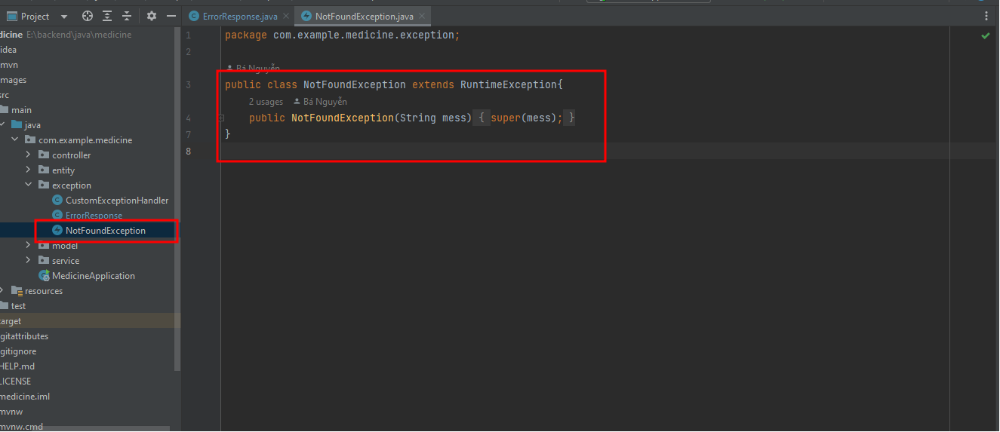
- Class này sẽ chịu trách nhiệm set status cho request nếu xảy ra lỗi.
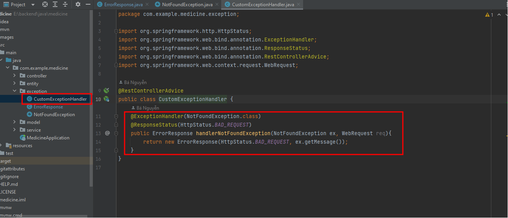


### Ứng Dụng Có Sử Dụng Các Thư Viện Hỗ Trợ
Được cài đặt theo gói pub get trong tệp pubspec.yaml
1. material-design: (có sẵn khi cài đặt gói).
2. assets image: (import hình ảnh để sử dụng cho dự án).
3. dev_dependencies: (hỗ trợ việc code web app).
4. fl_chart: ^0.12.0 (hỗ trợ vẽ line chart).
5. cupertino_icons: ^1.0.1 (để sử dụng icon của có sẵn của flutter).

## IDE sử dụng <a name = "ide"></a>
- Sử dụng visual studio code [Visual Studio code](https://code.visualstudio.com/)

### 💡 Test chương trình bằng web chrome


Bật phân quyền beta và cho web run web
```
 $ flutter channel beta
 $ flutter upgrade
 $ flutter config --enable-web
```

Chạy test ứng dụng trên chrome
```
$ cd MyApp
$ flutter run -d chrome
```
## Cấu trúc lib <a name="lib"></a>
### 💡 Lib
1. [DesktopScreen](#)
2. [Model](#)
3. [home](#)
4. [detail](#)

```main.dart```

### 💡 Screen View trên các device
Hiển thị trên 2 loại màn hình smartphone (width<800) và desktop (width>=800)
```
LayoutBuilder(
      builder: (context, constraints) {
        if (constraints.maxWidth < 800) {
          return HomeScreen();
        } else {
          return DesktopScreen(size: size);
        }
      },
    );
 ```
 
## Các PageView <a name="pageview"></a>
1. [Trang chủ](#home)
2. [Detail Tree](#detail)

### 💡 Trang Chủ <a name="home"></a>

This project is a starting point for a Flutter application.

A few resources to get you started if this is your first Flutter project:

- [Lab: Write your first Flutter app](https://flutter.dev/docs/get-started/codelab)
- [Cookbook: Useful Flutter samples](https://flutter.dev/docs/cookbook)

For help getting started with Flutter, view our
[online documentation](https://flutter.dev/docs), which offers tutorials,
samples, guidance on mobile development, and a full API reference.
